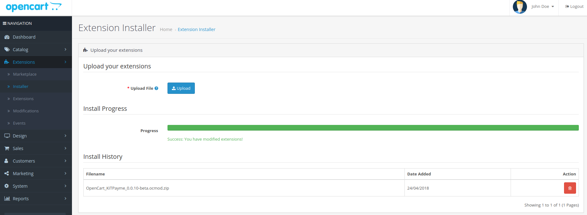
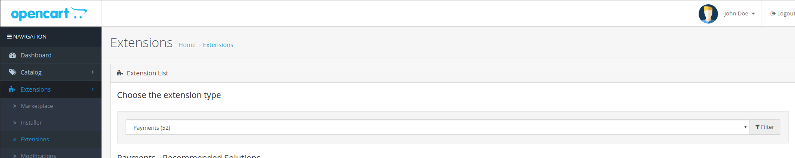
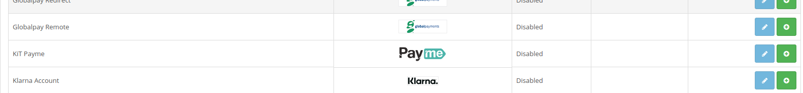
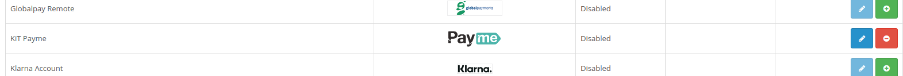
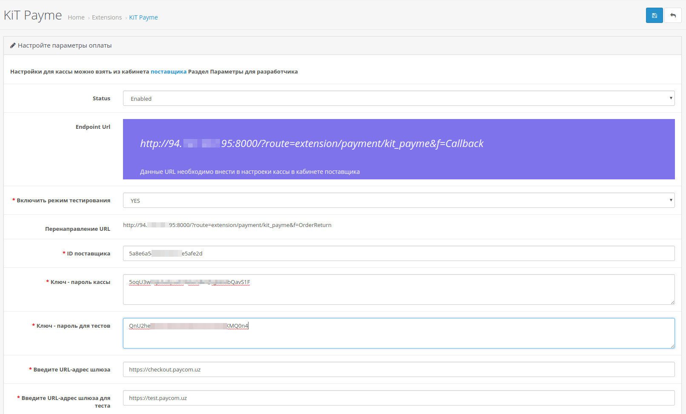
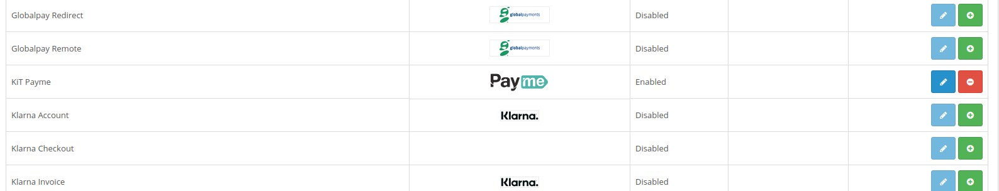
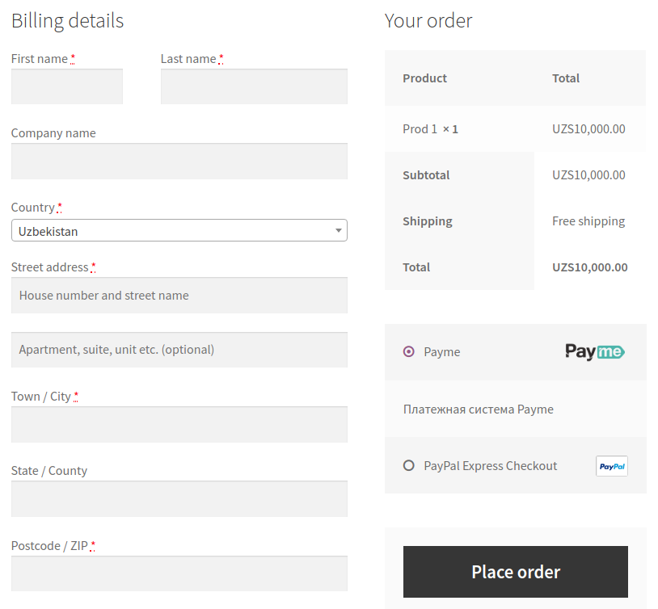

# OpenCart Payment Gateway

## Requirements

- OpenCart 3.x
- Merchant ID, Production & Test Keys
- Production & Test Gateway URLs

## Installation

Download the extension from [here](https://github.com/PaycomUZ/opencart-payment-gateway/releases/latest).

Sign into your OpenCart's admin panel.

Go to the `Extensions \ Installer` page.

Upload the downloaded ZIP archive.

Progress bar should become green to indicate successful upload.

Then go to the `Extensions \ Extensions` page and set the extension type filter as `Payments`.

Scroll the page little bit down and find the `KiT Payme` extension. 
Install it by clicking the green `+` button located on that line.

After successful installation green `+` button becomes red `-`, which removes the extension on click.

Now the extension is installed successfully, but not configured yet.

Click the blue pencil button to open configuration page of the extension.

In the opened page configure the extension as depicted in the following screenshot, but using own parameters.
Save the parameters.

Also set the `Endpoint URL` of the online cashdesk in the `Merchants Cabinet`.

Now extension should become `Enabled` and ready to use.

From now on the users can choose `Payme` as a payment method on the `Checkout` page.

